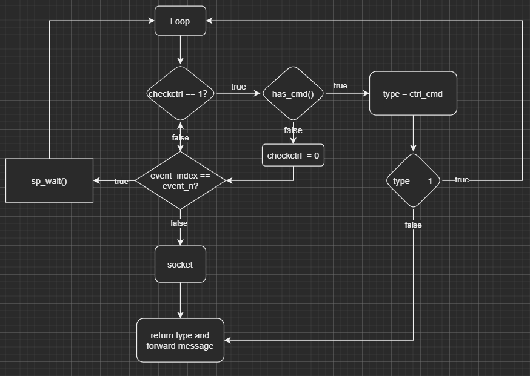

本文主要是分析skynet socket线程的执行流程。


先来看看socket线程的循环函数：

```skynet_socket.c
int 
skynet_socket_poll() {
	struct socket_server *ss = SOCKET_SERVER;
	assert(ss);
	struct socket_message result;
	int more = 1;
	int type = socket_server_poll(ss, &result, &more);
	switch (type) {
	case SOCKET_EXIT:
		return 0;
	case SOCKET_DATA:
		forward_message(SKYNET_SOCKET_TYPE_DATA, false, &result);
		break;
	case SOCKET_CLOSE:
		forward_message(SKYNET_SOCKET_TYPE_CLOSE, false, &result);
		break;
	case SOCKET_OPEN:
		forward_message(SKYNET_SOCKET_TYPE_CONNECT, true, &result);
		break;
	case SOCKET_ERR:
		forward_message(SKYNET_SOCKET_TYPE_ERROR, true, &result);
		break;
	case SOCKET_ACCEPT:
		forward_message(SKYNET_SOCKET_TYPE_ACCEPT, true, &result);
		break;
	case SOCKET_UDP:
		forward_message(SKYNET_SOCKET_TYPE_UDP, false, &result);
		break;
	case SOCKET_WARNING:
		forward_message(SKYNET_SOCKET_TYPE_WARNING, false, &result);
		break;
	default:
		skynet_error(NULL, "Unknown socket message type %d.",type);
		return -1;
	}
	if (more) {
		return -1;
	}
	return 1;
}
```

主要关注的是socket_server_poll函数, 此函数会返回本次操作的类型, 再由socket的pipe将数据与操作转发至所绑定的service中。


socket_server_poll函数比较长, 我们分几各部分来看。

总的循环流程为:

1. sp_wait等待激活事件, 激活事件分为pipe的通知和socket的通知。

2. 设置checkctrl。

3. 进入checkctrl==1的分支。

4. 判断是否有cmd, 有就执行没有则将checkctrl置0。
5. ctrl_cmd的返回结果是否为-1, 是则继续循环, 否则将结果返回。

6. 循环直到checkctrl == 0为止。
7. 判断event_index == event_n, 为真则执行sp_wait。

8. 判断socket事件并执行。

   




### 一

```skynet_socket.c
socket_server_poll(struct socket_server *ss, struct socket_message * result, int * more) {
	if (ss->checkctrl) {
		if (has_cmd(ss)) {
			int type = ctrl_cmd(ss, result);
			if (type != -1) {
				clear_closed_event(ss, result, type);
				return type;
			} else
				continue;
		} else {
			ss->checkctrl = 0;
		}
    }
	...
}
```

skynet的架构中，worker中的listen、connect和accept的操作都需要有与socket线程的交互，worket和socket线程之间通过pipe通讯，所以socket线程除了与socket交互外, 还需要处理pipe的请求数据, 所以在每次sp_wait返回时，都会将chekctrl置1，在下一次循环时执行has_cmd，当cmd执行完后才进入下一步。

 

### 二

```
socket_server_poll(struct socket_server *ss, struct socket_message * result, int * more) {
	...
		if (ss->event_index == ss->event_n) {
			ss->event_n = sp_wait(ss->event_fd, ss->ev, MAX_EVENT);
			ss->checkctrl = 1;
			if (more) {
				*more = 0;
			}
			ss->event_index = 0;
			if (ss->event_n <= 0) {
				ss->event_n = 0;
				if (errno == EINTR) {
					continue;
				}
				return -1;
			}
		}
    ...
}
```

event_index对应的是当前处理到的事件的下标索引, event_n是激活的事件总数, 当他们相等时表示上次获取的激活event已处理完, 需执行sp_wait等待下一次的激活事件。


sp_wait主要分为调用epoll_wait(以epoll为例)和记录每个event相应的事件两个操作。sp_wait的代码如下：

```
static int 
sp_wait(int efd, struct event *e, int max) {
	struct epoll_event ev[max];
	int n = epoll_wait(efd , ev, max, -1);
	int i;
	for (i=0;i<n;i++) {
		e[i].s = ev[i].data.ptr;
		unsigned flag = ev[i].events;
		e[i].write = (flag & EPOLLOUT) != 0;
		e[i].read = (flag & (EPOLLIN | EPOLLHUP)) != 0;
		e[i].error = (flag & EPOLLERR) != 0;
		e[i].eof = false;
	}

	return n;
}
```

sp_wait获取完激活的事件列表和数据后, 把checkctrl设为1并继续循环处理相应的事件。


### 三

最后一块为对socket的处理, 每次从ss->ev中取出一个事件, 不同事件的type执行不同操作。其中会有一些操作要与所绑定的service交互。

```
socket_server_poll(struct socket_server *ss, struct socket_message * result, int * more) {
		struct event *e = &ss->ev[ss->event_index++];
		struct socket *s = e->s;
		if (s == NULL) {
			// dispatch pipe message at beginning
			continue;
		}
		struct socket_lock l;
		socket_lock_init(s, &l);
		switch (s->type) {
		case SOCKET_TYPE_CONNECTING:
			return report_connect(ss, s, &l, result);
		case SOCKET_TYPE_LISTEN: {
			int ok = report_accept(ss, s, result);
			if (ok > 0) {
				return SOCKET_ACCEPT;
			} if (ok < 0 ) {
				return SOCKET_ERR;
			}
			// when ok == 0, retry
			break;
		}
		case SOCKET_TYPE_INVALID:
			skynet_error(NULL, "socket-server: invalid socket");
			break;
		default:
			if (e->read) {
				int type;
				if (s->protocol == PROTOCOL_TCP) {
					type = forward_message_tcp(ss, s, &l, result);
				} else {
					type = forward_message_udp(ss, s, &l, result);
					if (type == SOCKET_UDP) {
						// try read again
						--ss->event_index;
						return SOCKET_UDP;
					}
				}
				if (e->write && type != SOCKET_CLOSE && type != SOCKET_ERR) {
					// Try to dispatch write message next step if write flag set.
					e->read = false;
					--ss->event_index;
				}
				if (type == -1)
					break;				
				return type;
			}
			if (e->write) {
				int type = send_buffer(ss, s, &l, result);
				if (type == -1)
					break;
				return type;
			}
			if (e->error) {
				// close when error
				int error;
				socklen_t len = sizeof(error);  
				int code = getsockopt(s->fd, SOL_SOCKET, SO_ERROR, &error, &len);  
				const char * err = NULL;
				if (code < 0) {
					err = strerror(errno);
				} else if (error != 0) {
					err = strerror(error);
				} else {
					err = "Unknown error";
				}
				force_close(ss, s, &l, result);
				result->data = (char *)err;
				return SOCKET_ERR;
			}
			if(e->eof) {
				force_close(ss, s, &l, result);
				return SOCKET_CLOSE;
			}
			break;
		}
}
```


下一篇文章讲解当socket收到客户端的包时在skynet中是如何处理分包和粘包的。